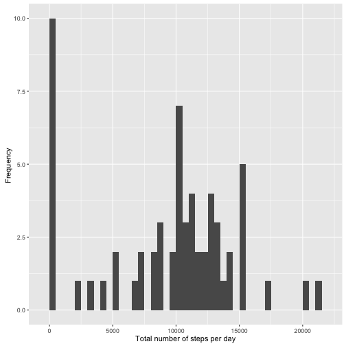
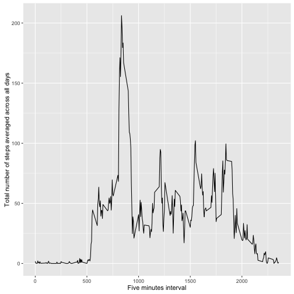
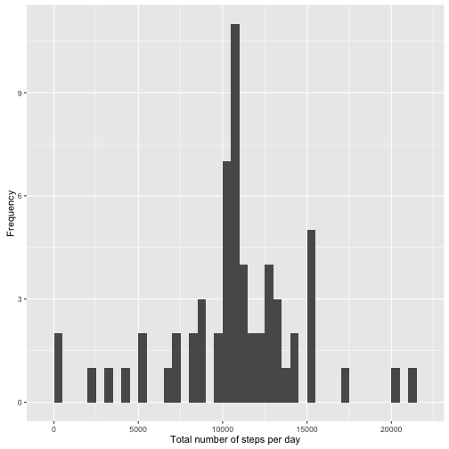
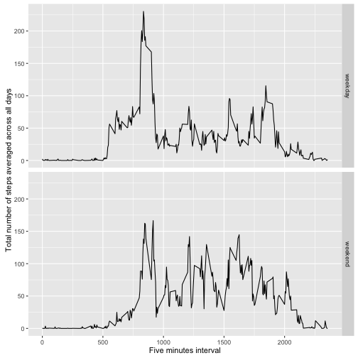

# Reproducible Research: Peer Assessment 1 
### Author: Giuseppe Di Bernardo

```r
setwd(dir = "/Users/joedibernardo/Projects/DATASCIENCE/ReproducibleResearch/week1/")
library(ggplot2)
library(plyr) 
```
## Loading and preprocessing the data
#### 1. Load the data (i.e. read.csv())

```r
if(!exists('activityData')){
  activityData <- read.csv(file = 'activity.csv', head = TRUE, sep = ",")
}
```

## What is mean total number of steps takes per day? 
#### 1. Make a histogram of the total number of steps takes each day

```r
# let's split data into groups, and apply the sum function to data within each subgroup
# If TRUE (the default), then if FUN always returns a scalar, tapply returns an array 
# with the mode of the scalar. 
stepsXday <- tapply(activityData$steps, activityData$date, sum, na.rm = TRUE)

qplot(stepsXday, geom = 'histogram', xlab = 'Total number of steps per day', ylab = 'Frequency ', binwidth = 500)
```

 
========================
#### 2. Calculate and report the mean and median total number of steps taken per day 

```r
Mean <- mean(stepsXday)
Median <- median(stepsXday)
```
* Mean = 9354.2295082 
* Mediam = 10395

## What is the average daily activity pattern? 
#### 1. Make a time series plot 

```r
StepsXfive <- aggregate(steps ~ interval, activityData, mean, na.rm = TRUE)

g <- ggplot(data = StepsXfive, aes(x = StepsXfive$interval, y = StepsXfive$steps)) 
g <- g + geom_line()
g <- g + xlab("Five minutes interval") 
g <- g + ylab('Total number of steps averaged across all days')
print(g)
```

 
===========
#### 2. Which 5-minute interval, on average across all the days in the dataset, contains the maximum number of steps?


```r
MaxNrofSteps <- which.max(StepsXfive$steps)
TimeMaxSteps <- StepsXfive$interval[MaxNrofSteps]
```
* 5-min interval - corresponding to the max nr. of steps - is at: 835

## Imputing missing values 
#### 1. Calculate and report the total number of NA values 

```r
NA_tot <- length(which(is.na(activityData[,]) == TRUE))
```
* Total nr. of missing values = 2304

#### 2. Devise a strategy for filling in all of the missing values in the dataset. 

#### 3. Create a new dataset that is equal to the original dataset but with the missing data filled in.

```r
activityData_fill <- activityData
activityData_fill[is.na(activityData_fill)] <- StepsXfive$steps
# I use the the mean for that 5-minute interval
```

#### 4. Make a histogram of the total number of steps taken each day

```r
stepsXday_fill <- tapply(activityData_fill$steps, activityData_fill$date, sum, na.rm = TRUE)
qplot(stepsXday_fill, geom = 'histogram', xlab = 'Total number of steps per day', ylab = 'Frequency', binwidth = 500)
```

 
=======
#### ... and calculate and report the mean and median total number of steps taken per day. 

```r
Mean_fill <- mean(stepsXday_fill)
Median_fill <- median(stepsXday_fill)
```

* Mean for imputed data set = $1.0766189 &times; 10<sup>4</sup>$
* Mediam for imputed data set = $1.0766189 &times; 10<sup>4</sup>$

## Are there differences in activity patterns between weekdays and weekends?
#### 1. Create a new factor variable in the dataset with two levels -- "weekday" and "weekend" indicating whether a given date is a weekday or weekend day.

```r
activityData_fill$dateType <- as.Date(activityData_fill$date)
weekdays1 <- c('Monday', 'Tuesday', 'Wednesday', 'Thursday', 'Friday')
activityData_fill$wDay <- c('weekend', 'weekday')[(weekdays(activityData_fill$dateType) %in% weekdays1)+1L]
```


#### 2. Make a panel plot containing a time series plot

```r
StepsXfive_fill <- aggregate(steps ~ interval + wDay, activityData_fill, mean, na.rm = TRUE)

g <- ggplot(data = StepsXfive_fill, aes(x = StepsXfive_fill$interval, y = StepsXfive_fill$steps)) 
g <- g + geom_line()
g <- g + facet_grid(wDay ~.) # to put the plots vertically each other
g <- g + xlab("Five minutes interval") 
g <- g + ylab('Total number of steps averaged across all days')
print(g)
```

 

